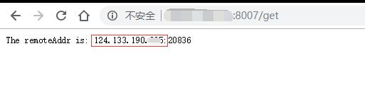

# curl-router

路由器定时地访问此服务的/curl路径，将路由器ip记录在此服务中，然后通过/get路径获取路由器ip

# run

```
./curl-router
```

or docker:

```
docker run -d -p 8007:3000 --restart=always zhizuqiu/curl-router:latest
```

#使用

在路由器的定时任务中设置：
```
* */1 * * * curl http://your_app_host:app_port/curl
```

获取ip时，在浏览器中访问：

http://your_app_host:app_port/get

